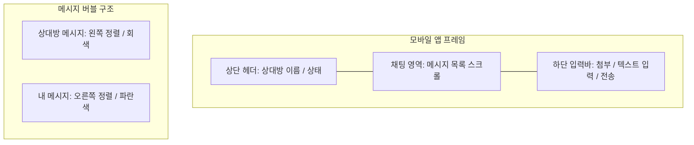
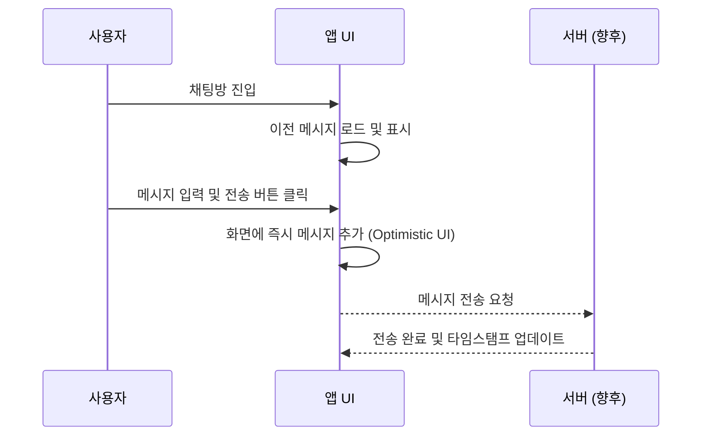

# Product Requirements Document (PRD) - Mobile Chat App

## 1. 프로젝트 개요
`imgs/mobile_chat.jpg` 이미지와 정의된 `design_system.md`를 기반으로 한 iOS 스타일의 모바일 채팅 애플리케이션입니다. 사용자 간의 실시간 메시징을 핵심 기능으로 하며, 깔끔하고 직관적인 UI/UX를 제공합니다.

## 2. 화면 레이아웃 (UI Layout)

## 3. 주요 기능 (Core Features)

### 3.1 채팅 인터페이스
- **메시지 버블:** 나(오른쪽, 파란색)와 상대방(왼쪽, 회색)을 구분하는 시각적 요소.
- **타임스탬프:** 메시지 전송 시간을 표시하여 대화 흐름 파악.
- **연속 메시지 처리:** 동일 사용자가 연속해서 메시지를 보낼 때의 간격 및 프로필 표시 최적화.

### 2.2 메시지 입력 및 전송
- **텍스트 입력창:** 멀티라인 지원 및 입력 내용에 따른 높이 자동 조절.
- **전송 버튼:** 텍스트 입력 시 활성화되는 인터랙션.
- **미디어 첨부:** 이미지, 파일 등을 첨부할 수 있는 액션 아이콘 제공.

### 2.3 헤더 및 내비게이션
- **상단 헤더:** 현재 대화 상대방의 이름과 상태 표시.
- **뒤로가기:** 채팅 목록으로 돌아가는 내비게이션 기능.

## 4. 사용자 흐름 (User Flow)

1. 사용자가 앱을 실행하고 특정 채팅방에 진입합니다.
2. 이전 대화 기록이 스크롤 가능한 형태로 로드됩니다.
3. 하단 입력창을 탭하여 키보드를 활성화하고 메시지를 작성합니다.
4. 전송 버튼을 누르면 메시지가 즉시 화면에 반영되고 상단으로 스크롤됩니다.

## 5. 기술적 요구사항 (Technical Requirements)

### 4.1 프론트엔드
- **UI Framework:** React 또는 Next.js (권장)
- **Styling:** Tailwind CSS 또는 CSS Modules (디자인 시스템 가이드 준수)
- **Responsive:** 모바일 뷰포트에 최적화된 레이아웃 (iOS Safe Area 대응)

### 4.2 디자인 시스템 준수
- **Colors:** `Primary (#007AFF)`, `Secondary (#F2F2F7)` 등 지정된 팔레트 사용.
- **Typography:** 시스템 폰트 스택 및 지정된 텍스트 스타일 적용.
- **Components:** `design_system.md`에 정의된 버블 패딩, 라운드값, 헤더 높이 등을 엄격히 적용.

## 6. 향후 확장성 (Future Roadmap)
- 실시간 소켓 통신 (Socket.io) 연결.
- 읽음 확인 (Read Receipt) 기능.
- 다크 모드 지원.
- 메시지 검색 기능.